# SafeLine WAF Home Lab with DVWA and Kali Linux

I built this home lab to understand how a Web Application Firewall sits in front of a vulnerable web application and how it reacts to common web attacks. The lab uses **Kali Linux** as the testing machine, **Ubuntu Server** as the web server, **DVWA** as the intentionally vulnerable application, and **SafeLine WAF** as the reverse proxy and protection layer.

This project was completed in an isolated lab environment that I own and control. The goal was not only to get the tools running, but also to verify the protection with logs and repeatable tests.

> **Reference:** I used the *Web Application Firewall Home Lab using SafeLine WAF* guide by Royden Rebello (The Social Dork) as a learning reference, then documented my own setup, troubleshooting, testing, and results.

## What I Practiced

- Building a small multi-VM security lab in VirtualBox
- Bridged networking between Kali Linux and Ubuntu Server
- Apache, PHP, MySQL, and DVWA setup
- Local hostname resolution with `/etc/hosts`
- SafeLine WAF deployment with Docker
- HTTPS using a self-signed certificate
- Reverse proxy configuration to the DVWA backend
- SQL injection detection and blocking
- HTTP request rate limiting / flood defense
- WAF-level username and password authentication
- Source-IP deny rules
- Reviewing WAF events and logs to verify security controls
- Troubleshooting application paths, networking, and service behavior

## Lab Architecture

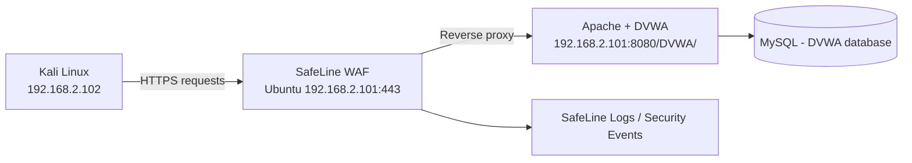

| Component | Purpose | Lab Address / Port |
|---|---|---|
| Kali Linux | Testing / attack simulation | `192.168.2.102` |
| Ubuntu Server | Hosts SafeLine, Apache, PHP, MySQL, DVWA | `192.168.2.101` |
| SafeLine WAF | HTTPS reverse proxy and protection layer | `443` / management `9443` |
| Apache / DVWA backend | Vulnerable web application | `8080/DVWA/` |
| Local name | Friendly hostname used from Kali | `dvwa.local` |

> The IP addresses above are private RFC1918 lab addresses and are not publicly routable.

## 1. SafeLine Certificate and Application Setup

I created a self-signed certificate for the lab and imported it into SafeLine. The protected application was then configured as `dvwa.local` on HTTPS/443 with a reverse-proxy upstream pointing to Apache on port 8080.

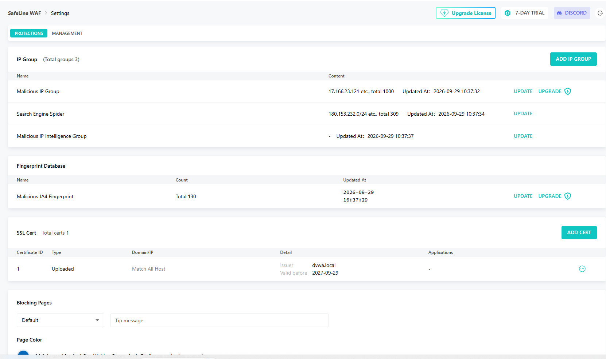

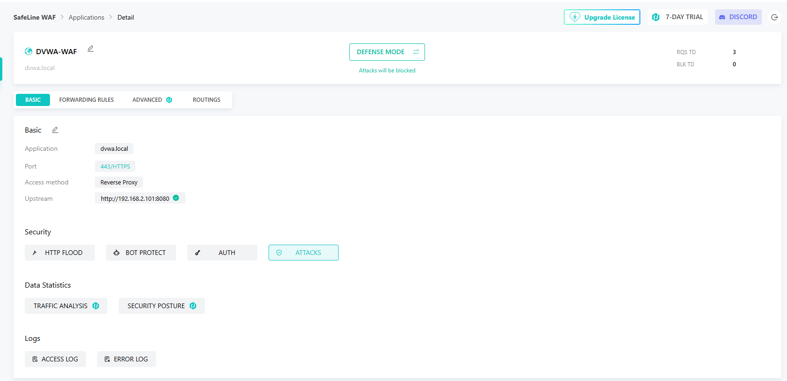

After adding `dvwa.local` to Kali's `/etc/hosts`, the DVWA login page could be reached through SafeLine over HTTPS.

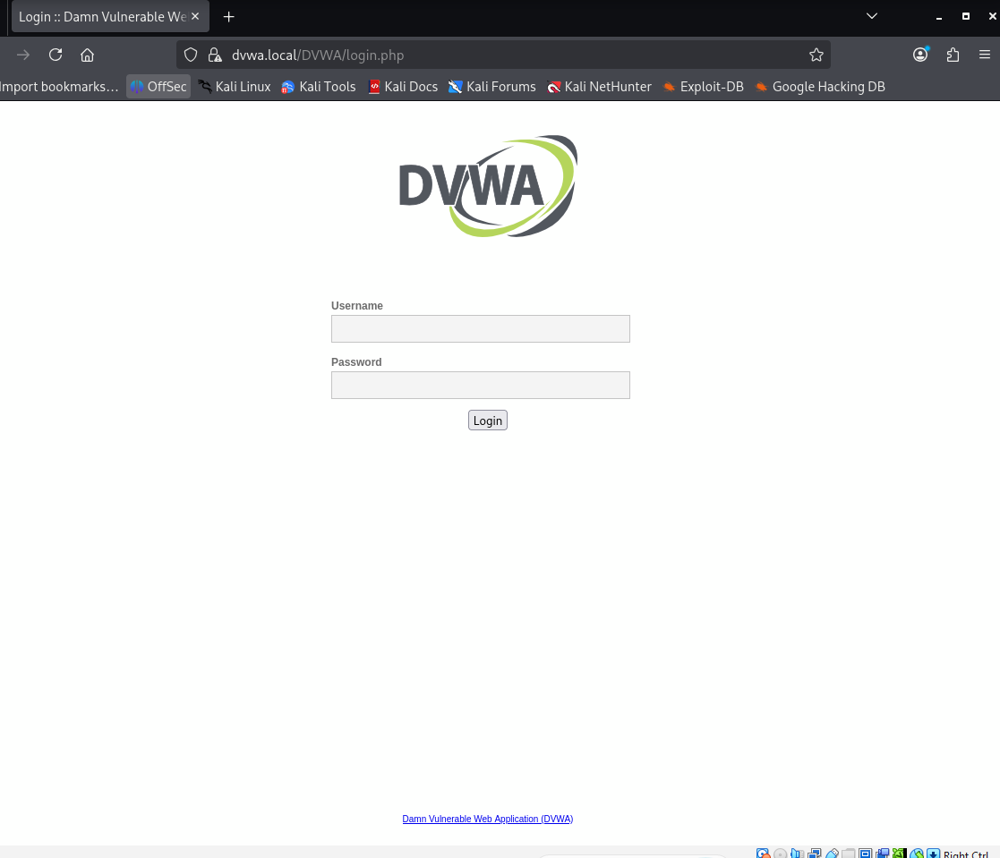

## 2. SQL Injection Protection Test

For the SQL injection test, I set DVWA Security to **Low** so the backend application was intentionally vulnerable. This made it possible to test whether SafeLine would stop the request before DVWA processed it.

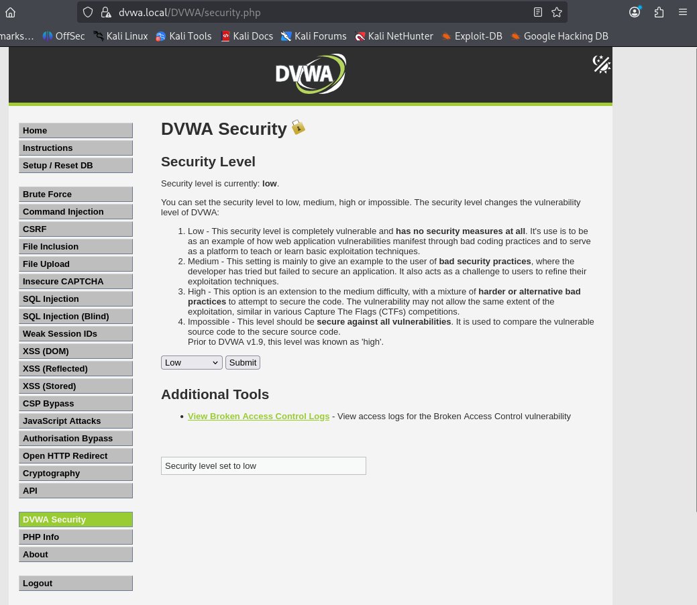

A basic SQL injection request was submitted from Kali. SafeLine returned an **Access Forbidden** page instead of allowing the request through.

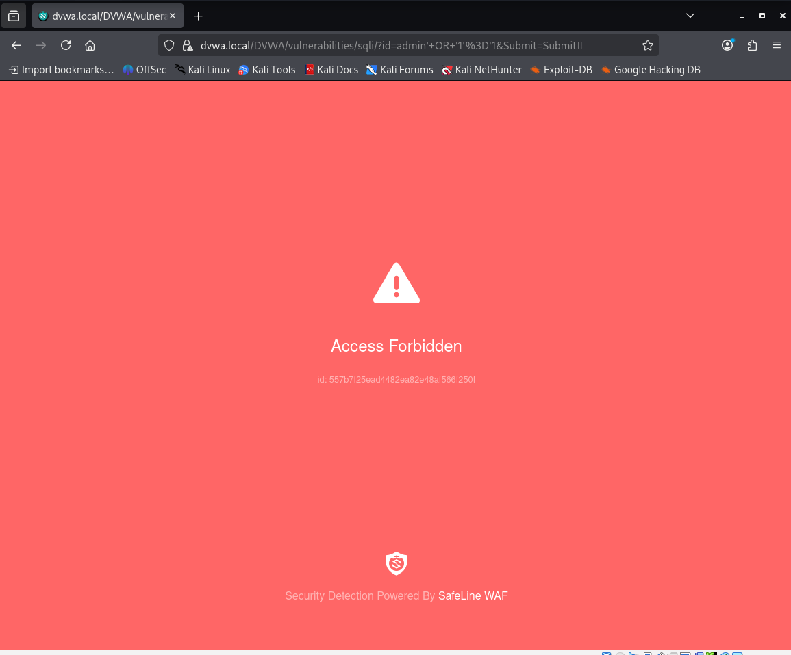

The SafeLine attack log identified the request as **SQL Inj**, recorded the Kali source IP, and showed the action as **Blocked**.

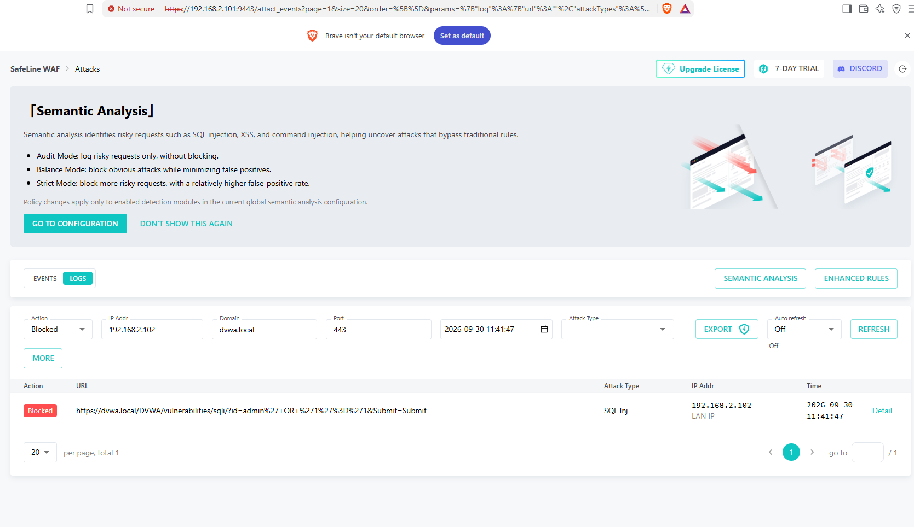

**Result:** SQL injection protection was successfully verified from both the browser side and the WAF log side.

## 3. HTTP Flood / Rate Limiting Test

I enabled SafeLine's Basic Access Limit with a threshold of **100 requests within 10 seconds**. When the threshold is reached, SafeLine applies an Anti-Bot challenge for 60 minutes.

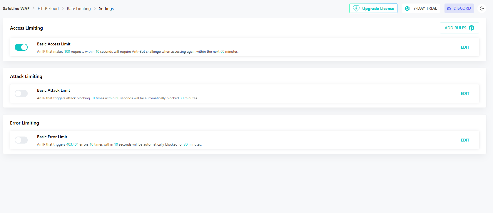

From Kali, I used ApacheBench (`ab`) to generate a small controlled burst of requests against my own DVWA lab. The test used 150 total requests with 10 concurrent requests.

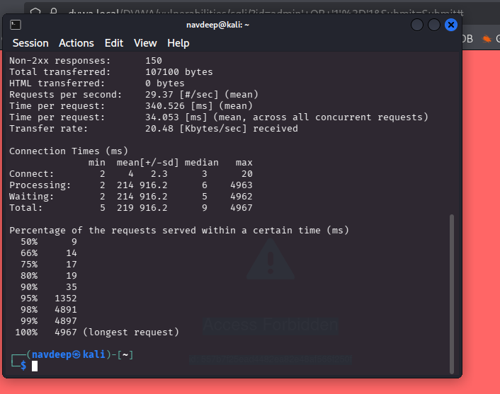

SafeLine recorded that the **100 requests in 10 seconds** threshold was triggered and applied the configured Anti-Bot challenge.

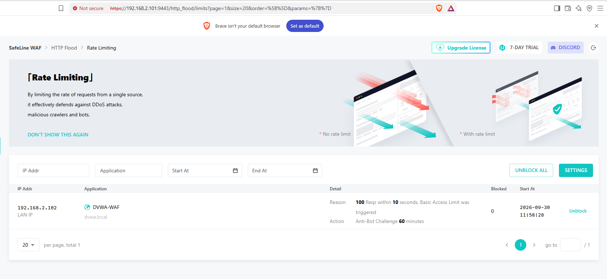

**Result:** The rate-limiting control triggered as configured. I did not describe this as a direct IP block because the configured action was an Anti-Bot challenge, not a deny action.

## 4. WAF Authentication Test

I created a local SafeLine authentication user and enabled **Simple Auth** for the DVWA application. When I accessed `dvwa.local` from Kali, SafeLine presented its own sign-in page before traffic was allowed to continue to DVWA.

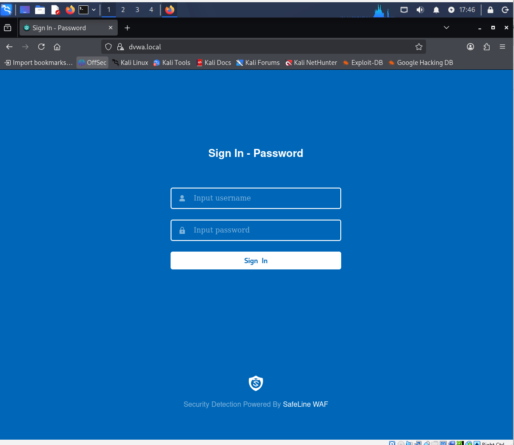

After successful authentication, SafeLine recorded an **Account password** login with an **Auth Result: SUCCESS**.

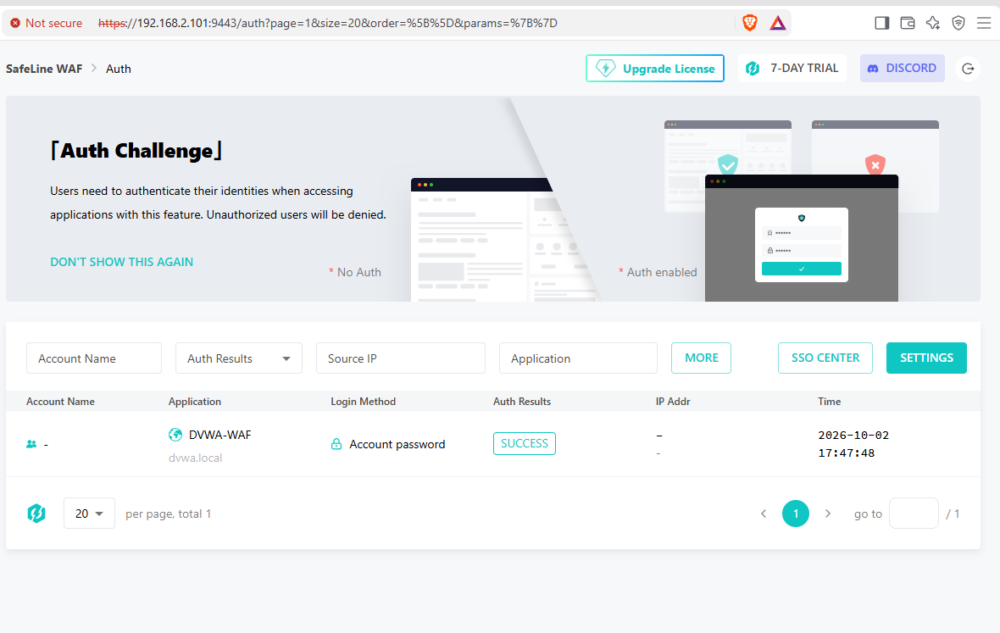

**Result:** The WAF successfully added an extra authentication layer in front of DVWA.

## 5. Custom Deny Rule Test

To test source-based access control, I created a custom deny rule for the Kali VM's source IP (`192.168.2.102`). The rule was inserted first in the blacklist and enabled.

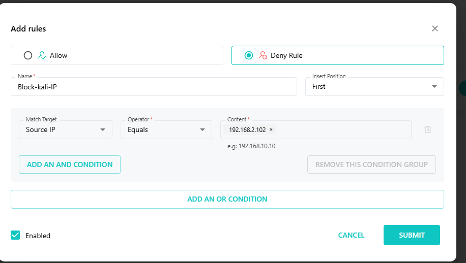

When Kali tried to access DVWA after the rule was enabled, SafeLine returned **Access Forbidden**.

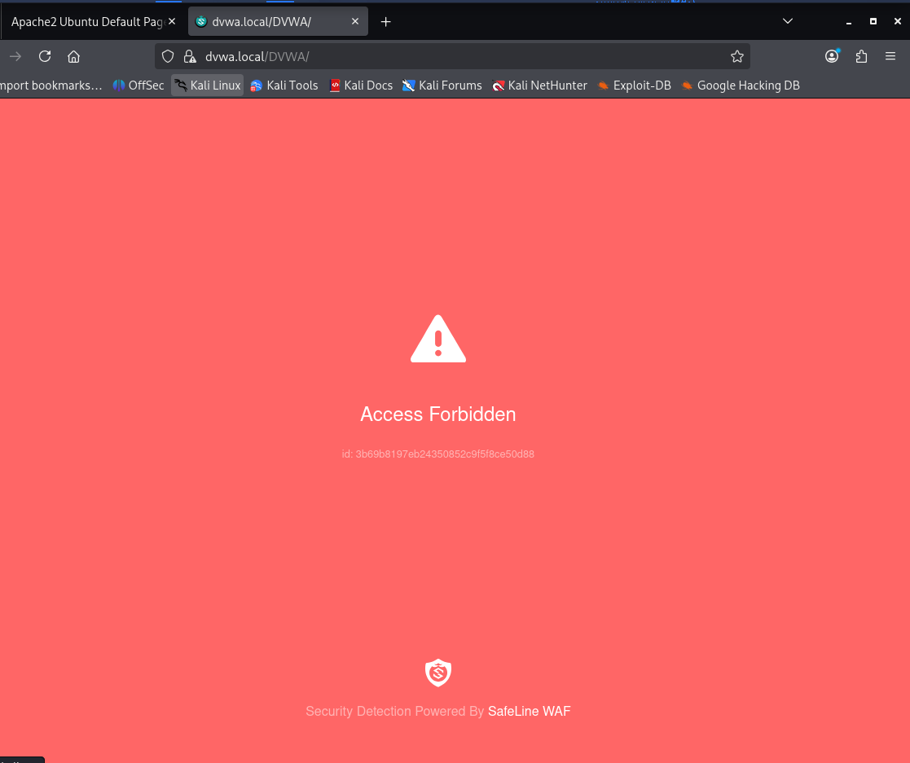

After the test, I disabled the temporary deny rule so the lab would not remain locked out for future use.

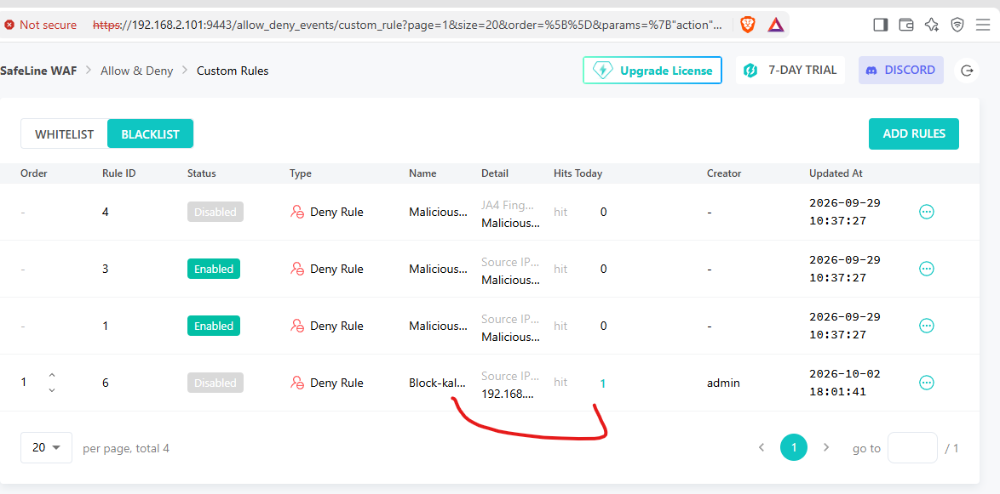

**Result:** Source-IP based access control worked as expected.

## Troubleshooting and What I Learned

A few issues made this project more useful than a straight installation walkthrough:

- **Kali was initially using NAT.** I changed it to a Bridged Adapter so Kali and Ubuntu received addresses on the same `192.168.2.0/24` network and could communicate directly.
- **`dvwa.local` did not resolve automatically.** I added a static mapping in Kali's `/etc/hosts`. This is local hostname resolution, not a full DNS server deployment.
- **The SafeLine root URL showed the Apache default page.** DVWA was installed under `/DVWA/`, so the working protected path was `https://dvwa.local/DVWA/`.
- **DVWA database setup needed troubleshooting.** The installed MySQL/DVWA combination required a small compatibility adjustment before the database setup completed successfully.
- **A SafeLine page appeared to hang during configuration.** I checked the Docker containers before making more changes and confirmed the services were healthy; the application configuration had actually been submitted.
- **The Ubuntu VM showed soft-lockup warnings under heavier load.** I used graceful shutdowns and verified the SafeLine containers were healthy after reboot before continuing testing.

The biggest lesson for me was that a security control should be verified with evidence. For each test, I tried to confirm both what the client saw and what SafeLine logged before calling the test successful.

## Security and Publishing Notes

- All testing was performed only in my isolated home lab.
- SafeLine administrator credentials are not included in this repository.
- Private key contents are not included.
- Session cookies and PHP session IDs are not published.
- Screenshots that displayed passwords, private-key material, or session values were intentionally excluded from the public evidence set.
- Lab-only passwords are omitted from the documentation.

## Repository Structure

```text
safeline-waf-dvwa-home-lab/
├── README.md
├── SECURITY_NOTES.md
├── assets/
│   └── screenshots/
│       ├── 01-ssl-certificate-imported.png
│       ├── 02-waf-application-reverse-proxy.png
│       ├── ...
│       └── 14-cleanup-rule-disabled.png
└── docs/
    ├── SafeLine-WAF-Home-Lab-Report.docx
    └── SafeLine-WAF-Home-Lab-Report.pdf
```

## Future Improvements

If I continue this lab, the next useful extensions would be:

- Test additional DVWA vulnerabilities such as XSS or command injection and compare WAF behavior
- Add OWASP Juice Shop as a second vulnerable application
- Forward WAF or web-server events into a SIEM for investigation practice
- Compare different SafeLine detection modes and rule behavior
- Add IDS/IPS or firewall telemetry to create a more complete multi-source investigation lab

## Ethical Use

This project is for education and authorized testing only. Attack techniques should only be used on systems you own or have explicit permission to test.
